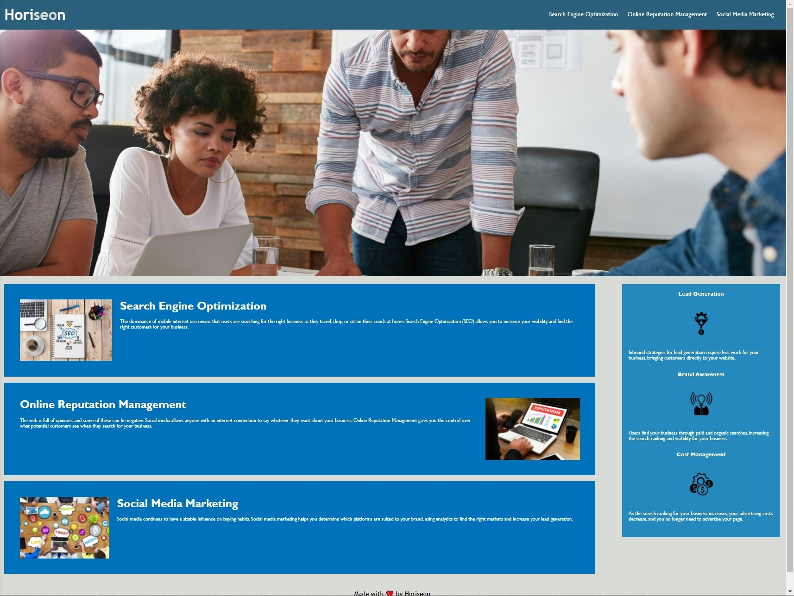

# code-refactor-css-demo-site

## Description
The objective of this project was to practice code refactoring, in this case to make the site more accessible. Web accessibility ensures that people with disabilities can access a website using assistive technologies. Accessibility is both good for business and for the company to avoid litigation.

I was tasked with reviewing the code and seeing where I can make improvements on the site's accessibility and design. In the index.html file, I revised the existing code by adding semantic html, adding alt attributes where needed, updating the title, and adding comments. In the style.css file, I grouped the selectors based on their type and added comments. The updated site should look like the screenshot below.

[Deployed Application](https://reginaldcapanzana.github.io/code-refactor-css-demo-site/)

